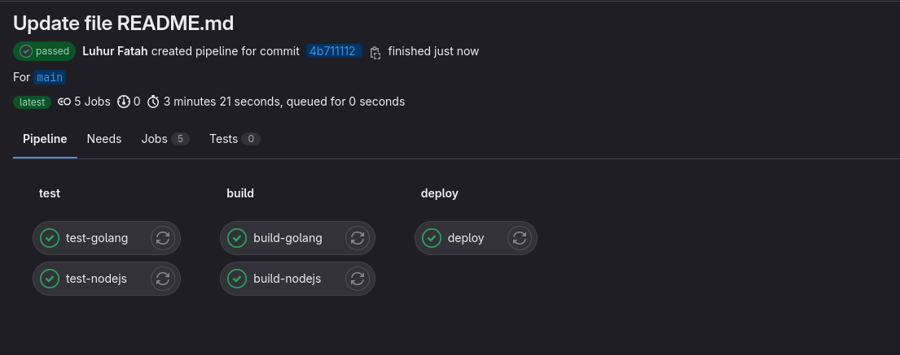
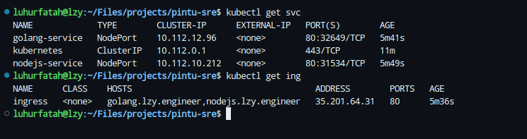
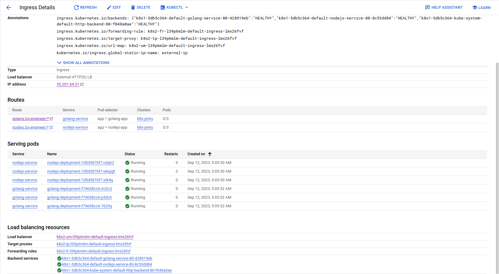
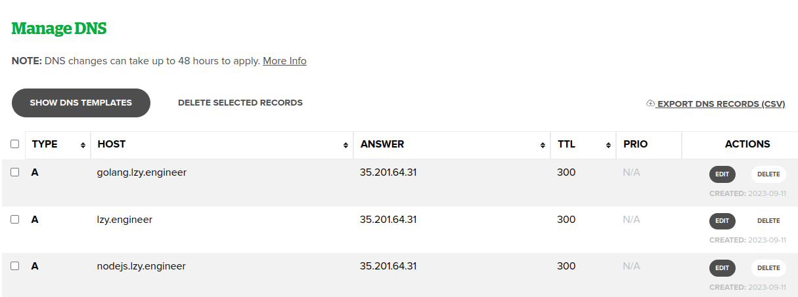
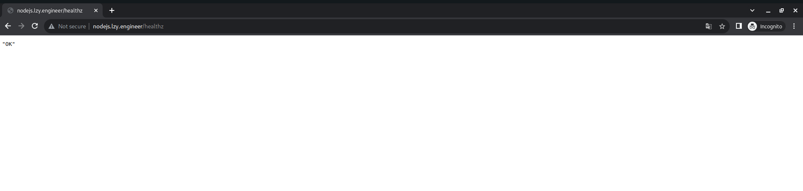
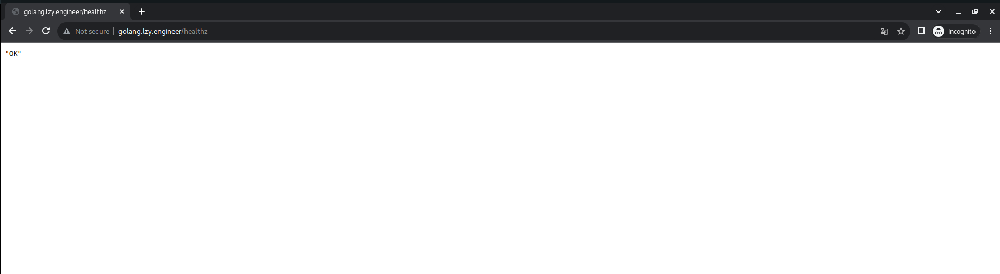
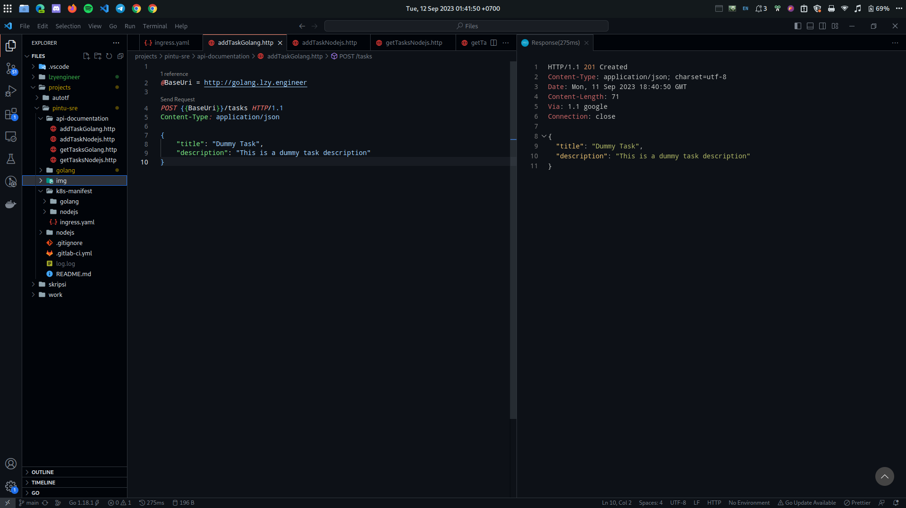

# Infrastructure Setup

First, we need to setup the GKE cluster that we will use later to deploy the app. Here i am using GKE standard cluster.

```
 gcloud beta container clusters create "k8s-pintu" \
  --project "pintu-sre" \
  --zone "asia-southeast2-a" \
  --no-enable-basic-auth \
  --cluster-version "1.27.3-gke.100" \
  --release-channel "None" \
  --machine-type "e2-highmem-2" \
  --image-type "COS_CONTAINERD" \
  --disk-type "pd-standard" \
  --disk-size "50" \
  --metadata disable-legacy-endpoints=true \
  --spot \
  --num-nodes "3" \
  --enable-ip-alias \
  --network "projects/pintu-sre/global/networks/default" \
  --subnetwork "projects/pintu-sre/regions/asia-southeast2/subnetworks/default" \
  --no-enable-intra-node-visibility \
  --default-max-pods-per-node "110" \
  --no-enable-master-authorized-networks \
  --addons HorizontalPodAutoscaling,HttpLoadBalancing \
  --enable-autoupgrade \
  --enable-autorepair \
  --max-surge-upgrade 1 \
  --max-unavailable-upgrade 0 \
  --no-enable-managed-prometheus \
  --enable-shielded-nodes \
  --node-locations "asia-southeast2-a"

```

After the cluster has been successfully created, i proceed to deploy the golang and nodejs app to the k8s cluster that has just created, but i will do it using cicd script that has already been created before, i just need to setup the service account and pass it to the variable, then i just need to trigger the pipeline.

<details>
<summary>Pipeline</summary>


</details>

Then we proceed to deploy the service and the ingress using k8s manifest that has been created before.
<details>
<summary>K8s Status</summary>


</details>

We already deploy 2 service that is responsible for both golang and nodejs deployment, and  also already deploy the ingress that will route the request to the service based on the host. In GKE, ingress is deployed using GLB, and GLB use NEG as their backend, and for the frontend i already configure it to use a static IP Addreass which is 35.201.64.31. And since be dont configure our backend manually, the GLB will automatically create a health cheack that will check the readiness of the pod based on the response of http request to the / path, this will be a problem for us because our app doesn't have a route that handle / path, so we need to edit manually the healt check to request into /healtz instead of /, so our pod will not be mark not ready.
And the ingress is ready and all the backend is marked healty.
<details>
<summary>Ingress Status</summary>


</details>
After that, we just need to create a DNS record in the respective domain provider to route into our external IP Address.
<details>
<summary>Add DNS Record</summary>


</details>
After that, the infrastructure is ready, and can be access throuht internet.
<details>
<summary>Test Access nodejs</summary>


</details>

<details>
<summary>Test Access golang</summary>


</details>
<br>

The CI/CD setup also ready, and will automatically trigger of there is a commit in the repository.

# API Documentation
tes cicd tes
## Base URL
The base URL for all API endpoints is:
```
http://localhost:3000
```
## Get All Tasks
- Endpoint: /tasks
- Method: GET
- Description: Retrieve a list of all tasks.
- Response: A JSON array containing task objects.

Example Request:
```
curl -X GET http://localhost:8000/tasks
```

Example Response:
```
[
  {
    "title": "Task 1",
    "description": "Description of Task 1"
  },
  {
    "title": "Task 2",
    "description": "Description of Task 2"
  }
]
```

## Add a Task
- Endpoint: /tasks
- Method: POST
- Description: Create a new task.
- Request Body: JSON object with title (required) and description (optional) fields.
- Response: A JSON object representing the created task.

Example Request:
```
curl -X POST http://localhost:8000/tasks \
-H "Content-Type: application/json" \
-d '{
  "title": "Dummy Task",
  "description": "This is a dummy task description"
}'
```

Example Response:

```
{
  "title": "New Task",
  "description": "Description of the new task"
}
```

## Health Check
- Endpoint: /healthz
- Method: GET
- Description: Health check
- Response: a String "OK"

Example Request:
```
curl -X GET http://localhost:8000/healtz
```

Example Response:
```
"OK"
```

# Testing API

<details>
<summary>Test add new task to golang app</summary>



</details>
