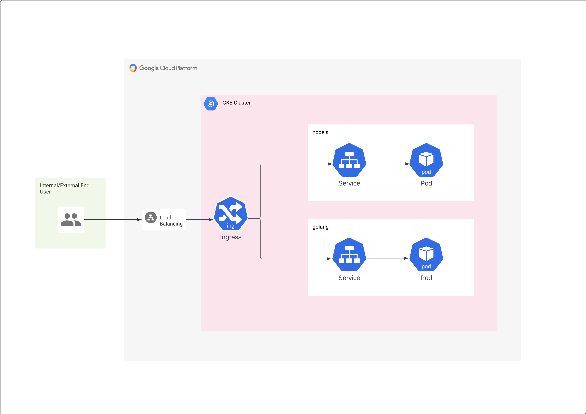

# Architecture

Here is the architecture of infrastructure :



# Cluster Deployment and Configuration

First, we need to setup the GKE cluster that we will use later to deploy the app. Here i am using GKE standard cluster.

```
 gcloud beta container clusters create "k8s-pintu" \
  --project "pintu-sre" \
  --zone "asia-southeast2-a" \
  --no-enable-basic-auth \
  --cluster-version "1.27.3-gke.100" \
  --release-channel "None" \
  --machine-type "e2-highmem-2" \
  --image-type "COS_CONTAINERD" \
  --disk-type "pd-standard" \
  --disk-size "50" \
  --metadata disable-legacy-endpoints=true \
  --spot \
  --num-nodes "3" \
  --enable-ip-alias \
  --network "projects/pintu-sre/global/networks/default" \
  --subnetwork "projects/pintu-sre/regions/asia-southeast2/subnetworks/default" \
  --no-enable-intra-node-visibility \
  --default-max-pods-per-node "110" \
  --no-enable-master-authorized-networks \
  --addons HorizontalPodAutoscaling,HttpLoadBalancing \
  --enable-autoupgrade \
  --enable-autorepair \
  --max-surge-upgrade 1 \
  --max-unavailable-upgrade 0 \
  --no-enable-managed-prometheus \
  --enable-shielded-nodes \
  --node-locations "asia-southeast2-a"

```

After creating the cluster, I deployed both the GoLang and Node.js apps on it using a CI/CD script that had been set up earlier. All I had to do was configure the service account and trigger the pipeline.

<details>
<summary><strong>Pipeline</strong></summary>


</details>

Then, I proceeded to deploy the service and the ingress using Kubernetes manifests that had been created previously.

<details>
<summary><strong>K8s Status</strong></summary>


</details>

## Service Setup

We've set up two services to handle the deployments:
- golang-service
- nodejs-service

We've also configured the ingress to route requests based on the host.

### GKE Configuration

For our Google Kubernetes Engine (GKE) setup, we're using Global Load Balancing (GLB) with Network Endpoint Groups (NEG) as the backend. We've also configured a static IP address (35.201.64.31) for the frontend.

## Health Check Adjustment

Now, here's the tricky part. GLB automatically creates a health check to see if our pods are ready. However, our app doesn't have a route for the `/` path, which causes an issue. To fix it, we manually changed the health check to request `/healthz` instead of `/`, ensuring that our pods are marked as ready.

<details>
<summary><strong>Ingress Status</strong></summary>


</details>

## DNS Configuration

After addressing the health check issue, we proceeded to create a DNS record with our domain provider to route traffic to our external IP address.

<details>
<summary><strong>Add DNS Record</strong></summary>


</details>

## Final Access Testing

With the infrastructure in place, we tested access to our services through the internet.

<details>
<summary><strong>Test Access to Node.js</strong></summary>


</details>

<details>
<summary><strong>Test Access to GoLang</strong></summary>


</details>


The CI/CD setup also ready, and will automatically trigger of there is a commit in the repository.

# API Documentation
## Base URL
The bese URI for Golang service
```
http://golang.lzy.engineer
```

The bese URI for Nodejs service
```
http://golang.lzy.engineer
```
## Get All Tasks
- Endpoint: /tasks
- Method: GET
- Description: Retrieve a list of all tasks.
- Response: A JSON array containing task objects.

Example Request:
```
curl -X GET http://$BASE_URI/tasks
```

Example Response:
```
[
  {
    "title": "Task 1",
    "description": "Description of Task 1"
  },
  {
    "title": "Task 2",
    "description": "Description of Task 2"
  }
]
```

## Add a Task
- Endpoint: /tasks
- Method: POST
- Description: Create a new task.
- Request Body: JSON object with title (required) and description (optional) fields.
- Response: A JSON object representing the created task.

Example Request:
```
curl -X POST http://$BASE_URI/tasks \
-H "Content-Type: application/json" \
-d '{
  "title": "Dummy Task",
  "description": "This is a dummy task description"
}'
```

Example Response:

```
{
  "title": "New Task",
  "description": "Description of the new task"
}
```

## Health Check
- Endpoint: /healthz
- Method: GET
- Description: Health check
- Response: a String "OK"

Example Request:
```
curl -X GET http://$BASE_URI/healtz
```

Example Response:
```
"OK"
```

# Testing API

<details>
<summary>Test add new task to golang app</summary>


</details>
